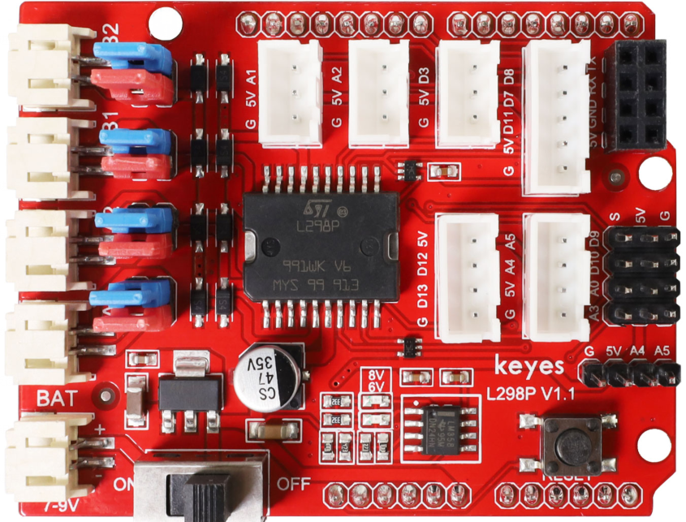
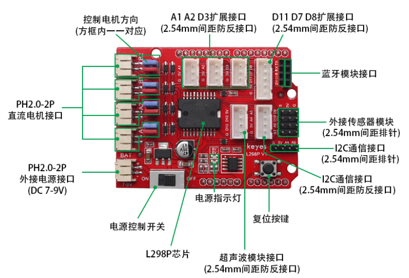
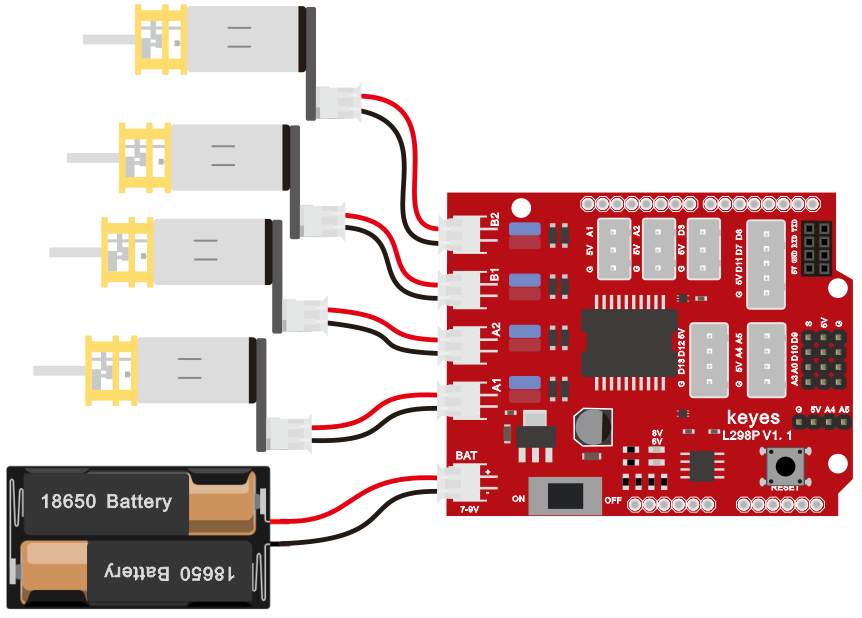

#  <center> <font color=blue> **Keyes brick L298P 电机驱动扩展板** </font> </center>



## 1、概述

&ensp;&ensp; 驱动电机的方法有很多，利用的L29P芯片驱动电机是非常常用的一种方案。 L298P是ST意法半导体公司出品的优秀大功率电机专用驱动芯片，可直接驱动直流电机、二相、四相步进电机，驱动电流达2A，电机输出端采用8只高速肖特基二极管作为保护。我们根据L298P的电路设计了一款扩展板，叠层的设计可直接插接到UNO R3板上使用，降低了用户使用和驱动电机的技术难度。

&ensp;&ensp;当我们将驱动扩展板堆叠在UNO R3板后，BAT上电后，将拨码开关拨至ON端，外接电源同时给驱动扩展板和UNO R3板供电。驱动扩展板上电机和电源接口为PH2.0-2P防反接口，防止你电源接反导致电路损坏和电机方向乱接，增加测试难度。

&ensp;&ensp;同时，驱动扩展板上自带一个间距为2.54mm的排母接口，也是串口通讯接口，兼容市面上常用的蓝牙模块线序，如HC-06模块、HM-10模块。为方便外接其他传感器/模块，驱动板上还自带3个XH-2.54mm 3P防反接口，2个XH-2.54mm 4P防反接口,1个XH-2.54mm 5P防反接口。扩展板还利用间距为2.54mm的排针扩展了2个数字口接口，2个模拟口接口和1个I2C通讯接口。扩展板上还自带一个复位按键，方便你随时进行复位处理。

&ensp;&ensp;扩展板可以连接4个直流电机，默认跳线帽连接方式时，A1和A2，B1和B2接口电机并联，运动规律相同。8个跳线帽可用于控制4个电机接口的转动方向，例如当A1电机接口前方2个跳线帽由横向连接改为纵向连接时，A1电机的转动方向就和原来的转动方向相反。


## 2、 规格参数

&ensp; &ensp; 2.1、DC输入电压：DC7V~9V

&ensp; &ensp; 2.2、 逻辑工作电流：最大36mA

&ensp; &ensp; 2.3、电机驱动电流：最大2A

&ensp; &ensp; 2.4、最大功耗：25W(温度＝75℃)

&ensp; &ensp; 2.5、工作温度：0 ~ 50℃

&ensp; &ensp; 2.6、尺寸大小：69x53x26mm

&ensp; &ensp; 2.7、重量：25.5克


## 3、GPIO示意图



&ensp;&ensp;6V LED指示灯：当外接电源电压低于6.2V时，LED熄灭；高于6.2V时，LED亮起。

&ensp;&ensp;8V LED指示灯：当外接电源低于8V时，LED熄灭；高于8V时，LED亮起。


## 4、连接图




##  5、示例代码

```C
//电机控制脚
#define EN_L 5                 //L298N使能 左电机使能
#define EN_R 6                 //L298N使能 右电机使能
#define  Motor_Right  2       //L298N IN2  右电机控制正反转
#define  Motor_Left  4        //L298N IN3  左电机控制正反转

void setup() 
{ 
  pinMode(Motor_Right,OUTPUT); 
  pinMode(Motor_Left,OUTPUT); 
  pinMode(EN_L,OUTPUT);
  pinMode(EN_R,OUTPUT);
} 

//小车前进
void advance()    
{
  analogWrite(EN_L,200); 
  analogWrite(EN_R,200); 
  digitalWrite(Motor_Right,HIGH);  
  digitalWrite(Motor_Left,HIGH);      
}

//小车后退
void back() 
{
  analogWrite(EN_L,200); 
  analogWrite(EN_R,200); 
  digitalWrite(Motor_Right,LOW);
  digitalWrite(Motor_Left,LOW);   
}

//小车左旋转
void left() 
{
  analogWrite(EN_L,200); 
  analogWrite(EN_R,200); 
  digitalWrite(Motor_Right,HIGH);
  digitalWrite(Motor_Left,LOW);   
}

//小车右旋转
void right() 
{
  analogWrite(EN_L,200); 
  analogWrite(EN_R,200); 
  digitalWrite(Motor_Right,LOW);
  digitalWrite(Motor_Left,HIGH);   
}

//小车停止
void stopp()  
{
  analogWrite(EN_L,0); 
  analogWrite(EN_R,0); 
}

void loop()
{
  advance();
  delay(1000);
  stopp();
  delay(200);
  back();
  delay(1000);
  stopp();
  delay(200);
  left();
  delay(1000);
  stopp();
  delay(200);
  right();
  delay(1000);
  stopp();
  delay(200);
}
```

## 6、实验结果

&ensp;&ensp; 在UNO R3控制上传好测试代码后，将扩展板堆叠在UNO R3控制板，按照接线图接线，上电后，两个电机模拟小车运动转动，模拟小车前进1秒，停止0.2秒；后退1秒，停止0.2秒；左旋转1秒，停止0.2秒；右旋转1秒，停止0.2秒；循环交替。

**注意：如果实验失败，请先按下面顺序检查**

1、先按接线图，检查线材连接是否正确

2、检查程序是否正确烧录致UNO板中

3、程序烧录报错时，请检查选择开发板是否正确

4、检查DC输入电压是否正确，或输入功率满足。电机功率较大，如果输入电源功率不足，则电机转动异常，或UNO板工作异常。
